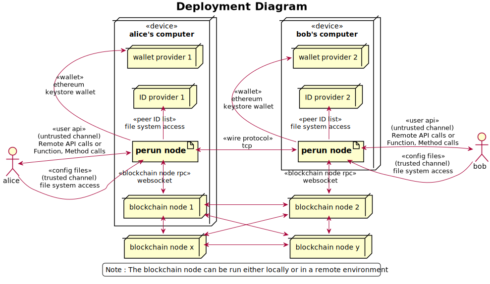

.. SPDX-FileCopyrightText: 2020 Hyperledger
   SPDX-License-Identifier: CC-BY-4.0

.. _User guide:

User guide
==========

Perun-node provides an interface for a user to open, use and settle multiple
payment channels, each involving same or different set of participants. The
interface provided by perun-node can be used in two ways:

  - As a library, by importing particular packages from perun-node go module
    and calling functions, methods provided by it.
  - As a stand-alone software, by running an instance perun-node and using
    client stubs to make remote API calls to the node.

In both the cases, the pre-requisites and the environment in which perun-node
or the component of software using perun-node as library will be deployed are
the same. This is described in the following two sections.

Deployment environment
----------------------

The below diagram shows the environment in which perun-node will be deployed.

In a test environment, the artifacts for setting up a contacts provider and
wallet provider can be generated using the ``generate command`` perun-node
software itself. But it is up to the user to set up a blockchain node and
provide its configuration. 

.. note::
    Recommended way for running a blockchain node in test environment is to use
    ganache-cli.

Pre-requisites
--------------

To use the perun-node, the following pre-requisites need to be met.

1. Linux operating system

2. Go (v1.14 or later)

3. (a) A running instance of ganache-cli (v6.9.1 or later) or
   (b) A local blockchain network started using geth or
   (c) A connection to the ropsten testnet.

.. note::
  If using ropsten testnet, user should have keys corresponding to accounts
  funded on the testnet and needs to follow additional steps when generating
  configuration artifacts.

.. note::
  For the code blocks that appear in the consequent sections, if they are
  prefixed by

  - **$**, execute them in terminal,
  - **>**, execute them in perun-node cli.

Setting up the blockchain network
^^^^^^^^^^^^^^^^^^^^^^^^^^^^^^^^^

.. _Using ganache-cli:

Using ganache-cli
"""""""""""""""""

To start a ``ganache-cli`` node, use the below command.

.. code-block::

  $ ganache-cli -b 1 --account="0x1fedd636dbc7e8d41a0622a2040b86fea8842cef9d4aa4c582aad00465b7acff,100000000000000000000" --account="0xb0309c60b4622d3071fad3e16c2ce4d0b1e7758316c187754f4dd0cfb44ceb33,100000000000000000000"

The ``account`` flag, we specify the private keys and the initial balance of
the accounts (10 ETH each) that are to be pre-funded. The ``b`` flag specifies
in the block time in seconds. It is the interval at which new blocks will be
mined.

.. note::
  These addresses are already included in the default test configuration of
  perun-node and will be used when generating configuration artifacts in the
  later steps.

Using ropsten testnet
"""""""""""""""""""""

To connect with ropsten test, you can run a local ethereum node or use an
external service such as `infura <https://infura.io/>`_. In either case,

a. Ensure the node is accessible via **WebSockets-RPC** interface.

b. Create two accounts (one each for alice and bob). Fund them with a few
   ETH tokens by requesting from the faucet.

c. The contracts used by perun-node v0.5.0 have been deployed on the ropsten
   testnet at the following addresses:
   
   - adjudicator: ``0x7dd2c7d72aAADaE2467b429920d2df88798CCda4``
   - ETH asset holder: ``0x30241b890b0c1A2d9B6Ce3D172020647C94E2AFa``

Make note of the URL to connect with the blockchain node via WebSockets RPC;
the public addresses and the path to keystore files of the funded accounts; and
the contract addresses. These will be needed in later steps.
   

Run tests for perun-node
------------------------

Before using the perun-node, we can ensure if it is working on your machine by
running the tests.

1. Open a terminal, clone the project repository and switch into the project
   directory.

.. code-block::

  $ git clone https://github.com/hyperledger-labs/perun-node.git
  $ cd perun-node

2. Start ganache-cli as mentioned in :ref:`Using ganache-cli` section in a
   separate terminal.

   
3. Run the tests.

.. code-block::

  $ go tests -tags=integration -count=1 -p 1 ./...

Using the perun-node
--------------------

**Configuration**

To use the perun-node, we first need to specify the configuration for
initializing the node. This includes

- Parameters for connecting with the blockchain network.
- Addresses of perun adjudicator and asset holder contracts.
- List of adapters supported for off-chain communication, ID provider and
  currency parsing.

Once the node is initialized, we need to open a session. Within a session, an
instance of wallet provider, ID provider are initialized. For this, we need to
specify the following configuration data:

- (optional) Parameters for connecting with the blockchain network.
- (optional) Addresses of adjudicator and asset holder contracts.
- Parameters for connecting with the wallet provider.
- Parameters for connecting with ID provider.
- Parameters for accessing persistence database.

.. note::

  If the optional parameter values are provided in session config, then it
  will supersede the values provided in node config.

.. note::

  In the tutorial, we will be using
  - A local file as ID provider.
  - Ethereum keystore as wallet provider.
  - levelDB as persistence database.

For steps to generate the configuration and doing a complete cycle of payment
channel transaction, refer to the corresponding section depending upon your
choice of usage.

.. toctree::
   :maxdepth: 1

   user_guide_stand_alone
